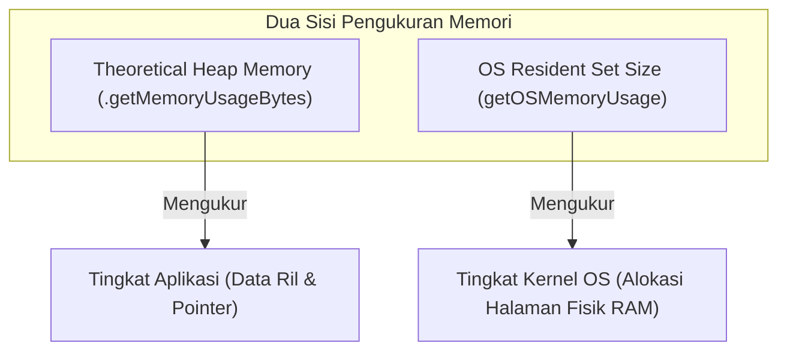

# Panduan Metodologi & Cara Kerja Benchmarking (Waktu & Memori)
*Sistem Manajemen Versi Dokumen — Praktikum Struktur Data 2026*

Dokumen ini menjelaskan secara rinci metodologi, cara kerja, dan arsitektur pengujian benchmark performa waktu eksekusi serta konsumsi memori pada sistem ini.

---

## 1. Metodologi Benchmark Performa (Waktu Eksekusi)

Modul benchmark performa dirancang untuk menguji efisiensi durasi waktu dari empat operasi utama sistem pada berbagai ukuran data ($N = 100$ hingga $100.000$ baris transaksi):

### A. Operasi yang Diuji
1. **INSERT (Penyisipan & Pemetaan)**:
   - Menguji seberapa cepat sistem menerima input data baru, memeriksa keberadaan ID di indeks pencarian, mengalokasikan entri dokumen, dan menyisipkan versi awalnya (v1). Jika dokumen sudah ada, ia akan menambahkan versi baru (v2, v3, dst.).
   - Operasi ini menggabungkan performa indeks pencarian (**HashMap vs BST**) dan kontainer riwayat versi (**LinkedList vs Stack**).
2. **SEARCH (Pencarian by ID)**:
   - Menguji kecepatan pencarian pointer dokumen berdasarkan ID uniknya.
   - Operasi pencarian mikro ini diulang sebanyak **100.000 kali** (`reps = 100000`) pada elemen tengah dataset untuk meredam fluktuasi *scheduling CPU* dan menghasilkan durasi rata-rata yang presisi.
3. **ROLLBACK (Pembuangan Versi Teratas)**:
   - Menguji kecepatan mencabut versi teratas (terbaru) dari dokumen dan mengembalikan status ke versi sebelumnya.
   - Pengulangan dilakukan sebanyak $\min(100, N/5)$ untuk mengukur durasi rata-rata yang stabil.
4. **DELETE (Penghapusan Dokumen)**:
   - Menguji durasi mencabut entri dokumen dari indeks pencarian utama secara permanen.

### B. Cara Pengukuran Waktu
Pengukuran waktu dilakukan secara presisi tingkat milidetik menggunakan pustaka standar `<chrono>` C++11/C++17:
* Objek timer (`Timer`) dideklarasikan untuk mencatat waktu mulai menggunakan `high_resolution_clock::now()`.
* Setelah operasi selesai dieksekusi, waktu akhir dicatat dan selisihnya dihitung dalam unit milidetik menggunakan `duration<double, milli>`.
* Hasil dihitung sebagai:
  $$\text{Rata-rata Waktu Operasi (ms)} = \frac{\text{Total Durasi Waktu Eksekusi}}{\text{Jumlah Pengulangan (Reps)}}$$

---

## 2. Metodologi Benchmark Konsumsi Memori

Sistem ini membandingkan penggunaan memori menggunakan dua perspektif yang berbeda secara bersamaan:



### A. Estimasi Memori Teoretis Heap (`Theoretical Heap`)
Dihitung secara terprogram dari dalam kode aplikasi untuk mendapatkan taksiran byte alokasi memori yang dialokasikan di heap dinamis.

#### Rumus & Komponen Kalkulasi:
1. **Ukuran Objek Statis**: Dihitung menggunakan operator `sizeof` (misal: `sizeof(Version)` menempati 48 byte pada arsitektur 64-bit).
2. **Dinamis Buffer String**: Menghitung kapasitas buffer alokasi string (`std::string::capacity()`) bukan panjang karakternya, karena string sering mencadangkan memori lebih besar di heap untuk pertumbuhan teks.
3. **Kapasitas Pointer Vector**: Pada Stack, internal vector dipantau melalui `stack.capacity() * sizeof(Version*)` untuk menghitung memori yang dicadangkan akibat strategi *capacity doubling* vector.
4. **Struktur BST & Hash Map**:
   - Hash Map menghitung memori statis array bucket (`TABLE_SIZE` $\times$ 8 byte) ditambah ukuran dinamis setiap `HashNode`.
   - BST menghitung memori dinamis setiap `BSTNode` (termasuk kunci string, nilai data, dan overhead 2 pointer anak yaitu `left` dan `right` sebesar 16 byte per node).

### B. Pengukuran Memori Fisik OS (`OS Resident Set Size - RSS`)
Mengukur jumlah halaman memori fisik nyata (RAM) yang dialokasikan oleh kernel OS untuk proses program ini.

#### Implementasi Lintas Platform (`#ifdef`):
* **macOS**: Memanggil API Mach kernel `task_info()` untuk mengambil statistik `mach_task_basic_info` guna membaca properti `resident_size`.
* **Windows**: Menggunakan API PSAPI `GetProcessMemoryInfo()` untuk membaca properti `WorkingSetSize` dari struktur `PROCESS_MEMORY_COUNTERS`.
* **Linux**: Membaca file `/proc/self/statm`, memparsing kolom kedua (resident pages), dan mengalikannya dengan ukuran halaman sistem (`sysconf(_SC_PAGESIZE)` yang biasanya berukuran 4096 byte).

#### Prosedur Isolasi Pengukuran:
Untuk memastikan hasil pengukuran memori OS RSS akurat dan tidak tercampur:
1. Catat memori awal sebelum instansiasi (`beforeOS`).
2. Alokasikan manajer secara dinamis di heap: `m = new DocManager...`
3. Impor dataset transaksi ritel ke manajer tersebut.
4. Catat memori akhir setelah pemuatan data (`afterOS`).
5. Delta konsumsi dihitung: `afterOS - beforeOS`.
6. Hapus instansiasi manajer dari heap secara paksa (`delete m`) untuk memicu destructor agar memori RAM kembali bersih sebelum pengujian manajer berikutnya dimulai.

---

## 3. Sumber Dataset & Strategi Fallback

Benchmark otomatis menggunakan data input dengan ketentuan sebagai berikut:
1. **Pemuatan CSV Utama**:
   - Sistem akan mencari berkas dataset transaksi ritel riil bernama `Untitled spreadsheet - Year 2009-2010.csv` di direktori proyek.
   - Program memparsing baris ke-1 hingga ke-$N$ dari file CSV secara dinamis untuk memetakan kolom transaksi ritel menjadi metadata versi dokumen.
2. **Generator Sintetis (Fallback)**:
   - Jika berkas CSV tidak ditemukan atau jumlah barisnya kurang dari target $N$, program secara otomatis mengaktifkan generator data sintetis (`generateDataset`).
   - Generator ini menggunakan seed tetap (`mt19937 rng(42)`) untuk membangkitkan data transaksi acak yang terstruktur sama agar pengujian tetap berjalan konsisten dan reproduksibel di mana saja.

---

## 4. Cara Menjalankan Benchmark

### A. Melalui CLI Interaktif
Jalankan program `./doc_version_system` dan pilih menu berikut:
- **Pilihan 10**: Menjalankan benchmark durasi performa waktu eksekusi.
- **Pilihan 12**: Menjalankan benchmark penggunaan memori teoretis & OS RSS.

### B. Melalui Mode Otomatis (Tanpa CLI)
Untuk keperluan otomatisasi pengujian, jalankan perintah terminal:
```bash
make benchmark
```
Ini akan memicu eksekusi otomatis program dengan flag `./doc_version_system --benchmark` dan langsung mengekspor hasil ke berkas **`benchmark_results.csv`** dan **`benchmark_memory.csv`**.
