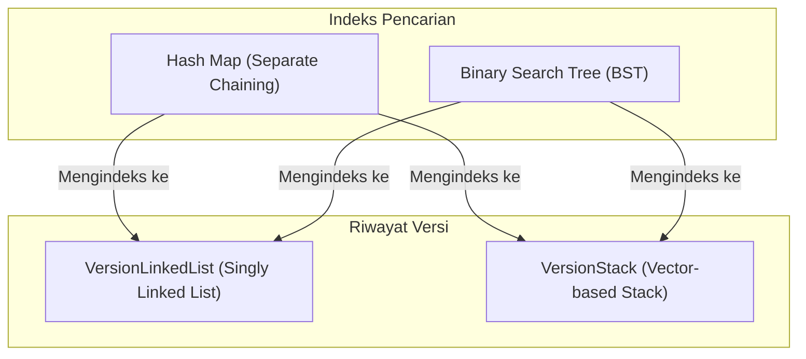

# Analisis dan Deskripsi Sistem Manajemen Versi Dokumen (Document Version Control System)
*Struktur Data - Proyek Ujian Praktikum*

Repositori ini berisi implementasi sistem manajemen versi dokumen (version control sederhana) dalam bahasa C++ (kompatibel dari C++11 hingga C++20). Proyek ini membandingkan efisiensi performa waktu eksekusi dan konsumsi memori dari empat kombinasi sistem yang terbentuk dari dua struktur data pelacak riwayat versi (**Singly Linked List** dan **Array-based Stack (std::vector)**) serta dua indeks pencarian dokumen (**Hash Map dengan Separate Chaining** dan **Binary Search Tree (BST)**) untuk mempercepat pencarian dokumen berdasarkan ID dan Nama.

Sistem juga terintegrasi dengan dataset transaksi ritel nyata (`Untitled spreadsheet - Year 2009-2010.csv`) yang diimpor sebagai basis data dokumen dinamis dan memiliki sistem benchmark performa memori (teoretis heap dan OS Resident Set Size/RSS).

---

## 1. Arsitektur Sistem

Secara garis besar, sistem manajemen versi ini bekerja dengan mengindeks setiap dokumen menggunakan ID unik ke dalam salah satu dari dua indeks pencarian (Hash Map atau BST). Nilai (*value*) dari entri indeks tersebut berisi metadata dokumen beserta pointer ke riwayat versi dokumen (Singly Linked List atau Stack). 

Berikut adalah visualisasi struktur penyimpanan datanya:



---

## 2. Fitur Utama Sistem

### A. Manajemen Dokumen & Versi
- **Insert Dokumen**: Membuat dokumen baru dengan versi awal (v1).
- **Tambah Versi**: Menambahkan versi baru ke dokumen yang sudah ada (v1 $\rightarrow$ v2 $\rightarrow$ v3).
- **Rollback Versi**: Menghapus versi terbaru dan mengembalikan dokumen ke versi sebelumnya.
- **Search & Retrieval**: Mencari dokumen secara cepat berdasarkan ID atau Nama menggunakan indeks pilihan:
  - **Hash Map**: $\mathcal{O}(1)$ average.
  - **Binary Search Tree (BST)**: $\mathcal{O}(\log N)$ average.
- **List Semua Dokumen**: Menampilkan daftar seluruh dokumen yang tersimpan di memori (diurutkan secara alfabetis/in-order jika menggunakan BST).
- **Simpan & Pemuat File**: Menyimpan seluruh basis data dokumen dan versinya ke file teks (`data_ll.txt`, `data_stack.txt`, `data_bst_ll.txt`, dan `data_bst_stack.txt`) dalam format pipe-separated (`|`).

### B. Integrasi Dataset Ritel Riil
Sistem mendukung penguraian (parsing) dataset transaksi ritel nyata (`Untitled spreadsheet - Year 2009-2010.csv` dengan ~525 ribu baris) menggunakan parser CSV kustom. Kolom dataset dipetakan secara dinamis ke atribut versi dokumen sebagai berikut:
- **StockCode** $\rightarrow$ ID Dokumen (`docId`)
- **Description** $\rightarrow$ Nama Dokumen (`docName`)
- **InvoiceDate** $\rightarrow$ Tanggal Versi (`date`)
- **Customer ID** $\rightarrow$ Penulis/Editor (`editor`)
- **InvoiceNo + Quantity + Price** $\rightarrow$ Konten Dokumen (`content`) dengan format `"Invoice: [InvoiceNo], Qty: [Quantity], Price: [Price]"`

Kemunculan pertama `StockCode` akan memicu pembentukan dokumen baru, sedangkan baris-baris berikutnya dengan `StockCode` yang sama akan diimpor sebagai versi-versi baru dari dokumen tersebut.

### C. Benchmark Kinerja Waktu & Memori
- **Benchmark Performa (Waktu)**: Membandingkan kecepatan operasi **INSERT**, **SEARCH**, **ROLLBACK**, dan **DELETE** untuk ukuran data $N$ = 100 hingga 100.000 records di antara 4 kombinasi (LL_HashMap, Stack_HashMap, LL_BST, Stack_BST). Output disimpan ke `benchmark_results.csv`.
- **Benchmark Memori**: Mengukur penggunaan memori dari masing-masing struktur data dengan dua metode:
  - *Theoretical Memory*: Menghitung alokasi heap teoretis secara presisi byte (overhead pointer, ukuran objek, kapasitas internal buffer string, dll.).
  - *OS RSS Memory*: Mengukur delta penggunaan memori fisik (Resident Set Size) proses di tingkat OS. Output disimpan ke `benchmark_memory.csv`.

---

## 3. Komparasi Teoretis Struktur Data

### A. Penyimpanan Versi: Singly Linked List vs Stack (Vector)

| Karakteristik / Operasi | Singly Linked List (`VersionLinkedList`) | Stack/Vector (`VersionStack`) | Analisis & Perbandingan |
| :--- | :---: | :---: | :--- |
| **Tambah Versi Baru**<br>(Push Back) | $\mathcal{O}(1)$ | $\mathcal{O}(1)$ *amortized* | LinkedList menyisipkan node di tail dalam waktu konstan. Stack menggunakan `std::vector::push_back` yang juga bernilai konstan amortisasi, namun sesekali memicu realokasi internal. |
| **Rollback Versi**<br>(Hapus Versi Terbaru) | $\mathcal{O}(N)$ | $\mathcal{O}(1)$ | **Keunggulan Stack**: LinkedList harus menelusuri dari `head` untuk menemukan simpul sebelum `tail` guna memperbarui pointer tail baru. Stack langsung menghapus elemen terakhir lewat `pop_back()` secara instan. |
| **Akses Versi Tertentu** | $\mathcal{O}(N)$ | $\mathcal{O}(1)$ | **Keunggulan Stack**: LinkedList memerlukan penelusuran berantai $k$ langkah. Stack menyimpan elemen secara kontigu di memori sehingga indeks ke-$k$ diakses instan melalui offset array. |
| **Penggunaan Memori** | Lebih Hemat Overlap Realokasi | Lebih Hemat Pointer | LinkedList membutuhkan overhead pointer `next` (8-byte) per node baru dan alokasi dinamis individual di heap. Stack menyimpan pointer mentah secara kontigu, mengeliminasi overhead `next` pointer, namun rentan overhead kapasitas cadangan vector akibat strategi pelipatgandaan kapasitas (*vector capacity doubling*). |

### B. Indeks Pencarian: Hash Map vs Binary Search Tree (BST)

| Karakteristik / Operasi | Hash Map (`HashMap`) | Binary Search Tree (`BST`) | Analisis & Perbandingan |
| :--- | :---: | :---: | :--- |
| **Pencarian berdasarkan ID** | $\mathcal{O}(1)$ *average* | $\mathcal{O}(\log N)$ *average* | **Keunggulan Hash Map**: Menggunakan fungsi hash untuk langsung mengakses bucket dalam waktu konstan. BST memerlukan penelusuran dari root ke daun dengan membandingkan kunci secara leksikografis di setiap tingkat node. |
| **Pencarian berdasarkan Nama** | $\mathcal{O}(1)$ *average* | $\mathcal{O}(\log N)$ *average* | **Keunggulan Hash Map**: Map kedua `nameToId` memetakan nama ke ID secara langsung dalam $\mathcal{O}(1)$. BST melakukan pencarian kunci nama secara terpisah dalam waktu logaritmik. |
| **Penyisipan Dokumen Baru** | $\mathcal{O}(1)$ *average* | $\mathcal{O}(\log N)$ *average* | Hash Map menyisipkan node baru di awal linked list bucket (separate chaining) secara konstan. BST harus mencari lokasi daun yang tepat dengan membandingkan kunci secara rekursif sebelum mengalokasikan node baru. |
| **Penghapusan Dokumen** | $\mathcal{O}(1)$ *average* | $\mathcal{O}(\log N)$ *average* | Hash Map menghapus node dari chain bucket dalam waktu konstan rata-rata. BST memerlukan pencarian node target, dan jika node tersebut memiliki dua anak, harus dicari in-order successor terkecilnya untuk menggantikan posisinya. |
| **Pengurutan Kunci (Sorting)** | Tidak Terurut | Terurut secara In-Order | **Keunggulan BST**: Traversal in-order pada BST secara alami menghasilkan kunci yang terurut secara alfabetis (leksikografis) dengan biaya $\mathcal{O}(N)$. Hash Map tidak menjamin urutan data karena bergantung pada nilai sebaran fungsi hash. |
| **Penggunaan Memori** | Overhead Array Bucket | Overhead Dua Pointer Anak | Hash Map mengalokasikan array bucket statis berukuran `TABLE_SIZE` (1024 pointer) di awal, lalu overhead pointer `next` di setiap bucket node. BST tidak membutuhkan array statis, namun setiap node memiliki overhead dua pointer anak (`left` dan `right`, total 16-byte pada arsitektur 64-bit) terlepas dari apakah pointer tersebut berisi atau `nullptr`. |

---

## 4. Cara Menjalankan Kompilasi & Pengujian

### Kompilasi Program
Untuk mengompilasi program utama, jalankan perintah berikut pada terminal:
```bash
make clean && make
```
Ini akan memicu kompilasi `main.cpp` menggunakan standar `C++17` (atau `C++11`) dan optimasi `-O2` menghasilkan berkas biner `doc_version_system`.

### Menjalankan Benchmark
Untuk memicu seluruh pengujian otomatis (performa waktu dan memori sekaligus), jalankan:
```bash
make benchmark
```
Hasil benchmark akan tersimpan pada file `benchmark_results.csv` dan `benchmark_memory.csv`.
